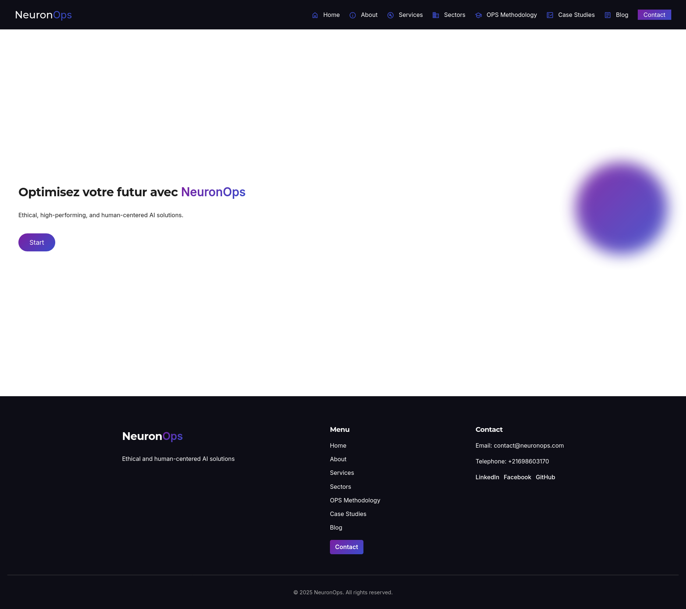

<!-- PROJECT SHIELDS -->

[](#)
[](#)
[](#)
[](#)
[](LICENSE)
[](https://www.linkedin.com/in/zouari-omar-143239283)

<h1 align="center">
  <br>
  <a href="https://neuron-ops.vercel.app"></a>
  <br>
  <a href="https://neuron-ops.vercel.app">NeuronOps</a>
  <br>
</h1>

<h6 align="center">
NeuronOps is a modern Angular-based application designed to provide a clean, scalable, and efficient frontend architecture.
It focuses on performance, maintainability, and developer productivity using the latest Angular features and best practices.
</h6>

<p align="center">
  <a href="#"></a>
  <a href="#"></a>
</p>

<p align="center">
  <a href="#key-features">Key Features</a> •
  <a href="#development">Development</a> •
  <a href="#how-to-use">How To Use</a> •
  <a href="#credits">Credits</a> •
  <a href="#license">License</a> •
  <a href="#contact" >Contact</a>
</p>



## Key Features

- **Modern Angular Stack**
  - Built with Angular CLI `v20.3.10`
  - Standalone components and optimized build pipeline
  - Modular and scalable project structure
- **Reusable Components**
  - Clean component-based architecture
  - Easy code scaffolding using Angular CLI
  - Shared modules and services for consistency
- **Live Reload & Fast Development**
  - Instant reload on file changes
  - Developer-friendly tooling and debugging support
- **Testing Ready**
  - Unit testing setup with Karma
  - E2E testing support (framework of your choice)

## Development

To start a local development server:

```bash
ng serve
```

Once the server is running, open your browser and navigate to:

```
http://localhost:4200
```

The application will automatically reload whenever you modify any source file.

## How To Use

Make sure you have the following installed:

- [Node.js](https://nodejs.org/)
- [Angular CLI](https://angular.dev/tools/cli)

Then follow these steps:

```bash
# Clone the repository
git clone https://github.com/ZouariOmar/neuron-ops.git

# Go into the project directory
cd neuron-ops

# Install dependencies
npm install

# Start the development server
ng serve
```

## Building

To build the project for production:

```bash
ng build
```

The build artifacts will be stored in the `dist/` directory and optimized for performance.

## Testing

### Unit Tests

Run unit tests using Karma:

```bash
ng test
```

### End-to-End Tests

```bash
ng e2e
```

> Angular CLI does not include an E2E framework by default. You may configure Cypress, Playwright, or another tool.

## Credits

This project uses the following technologies and tools:

- [Angular](https://angular.dev)
- [TypeScript](https://www.typescriptlang.org/)
- [Node.js](https://nodejs.org/)
- [Karma](https://karma-runner.github.io)

## License

This repository is licensed under the **GPL3.0 License**. You are free to use, modify, and distribute the content. See the [LICENSE](LICENSE) file for details.

## Contact

For questions or suggestions, feel free to reach out:

- **GitHub**: [ZouariOmar](https://github.com/ZouariOmar)
- **Email**: [zouariomar20@gmail.com](mailto:zouariomar20@gmail.com)
- **LinkedIn**: [Zouari Omar](https://www.linkedin.com/in/zouari-omar-143239283)

**Happy Coding!**
